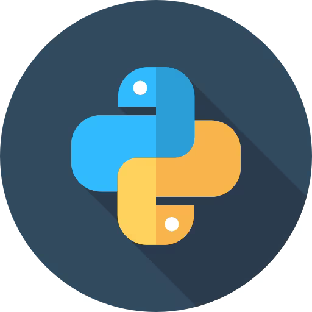

<h1 align="center">Yoo💀</h1>

Im <b><i>Haipa</i></b> - a 20 year old game developer, gamer and weeb
 
With 3 years of experience in Unity and C# (+ 2 in GameMaker: Studio) 
Ive worked on and published couple of projects solo 
Lately I am also passionate about learning Python and Fabric MC 
Check out my portfolio website at https://haipadev.github.io 

(If youre a job employer a big chunk of my repos are private) 
Contact me on [LinkedIn](https://linkedin.com/in/haipadev)

  

### 📜 Currently working on
<b>A big private project<b>🤫
 
And Minecraft mods
<!--Learning Python and Godot🤓 -->
<!---->
<!---->
<!---->
<!---->
<!---->
<!---->
<!---->

### 🌟 Favorite Technologies
  * 
  <!-- *  -->
  * 
  * 

### 📖 What I'm currently learning
  * 
  * 
  <!--* -->
  <!--* -->

### 📚 What I want to learn
  * 
  * 
  * 

<h2 align="center">🤓 Know and using</h2>

  
  
  
  
  <!--  -->

  

  
  
  
  

<h2 align="center">📈 Stats</h2>

  

<!--

  

-->

  

