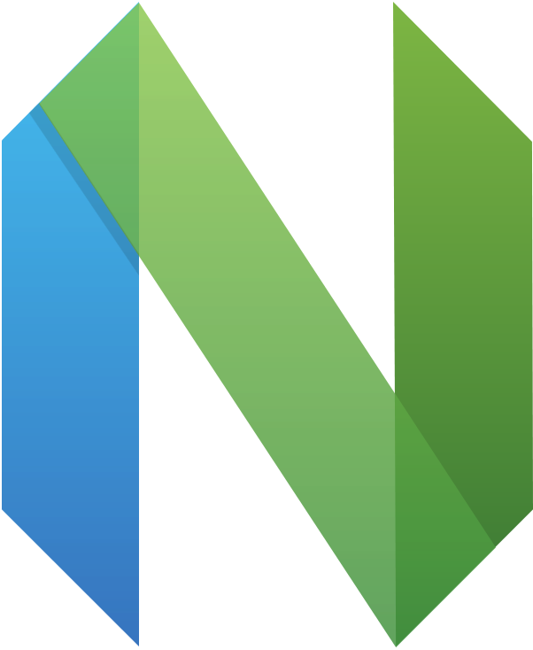

<h1 align="center">Hyper</h1>

Im a 21 year old indie game developer
 
With 4 years of experience in Unity & C# (+ 2 in GameMaker: Studio) 
Lately I am also passionate about learning C, C++ & RayLib 
Check out my portfolio website at https://hyperdotbat.github.io 

(If youre an employer, a big chunk of my repos are private) 
Contact me on [LinkedIn](https://linkedin.com/in/hyperdotbat)

 <!---->

### 🛠️ Currently working on
Learning C, C++, RayLib
<!--<b>A big private project<b> 🤫-->
<!--And Minecraft mods -->
<!---->
<!---->
<!---->
<!---->
<!---->
<!---->
<!---->
<!---->

### 🌟 Favorite Technologies
  * 
    
  * 
    
    
  * 
    

### 📖 What I'm currently learning
  * 
    
    
  * 
    
    

### 📚 I've dabbled in
  * 
  * 
    
  * 
    
  * 
    
    

<h2 align="center">🤓 Know and using</h2>

  
  
  

  

  
  
  

<h2 align="center">📈 Stats</h2>

  

<!--

  

-->

  

